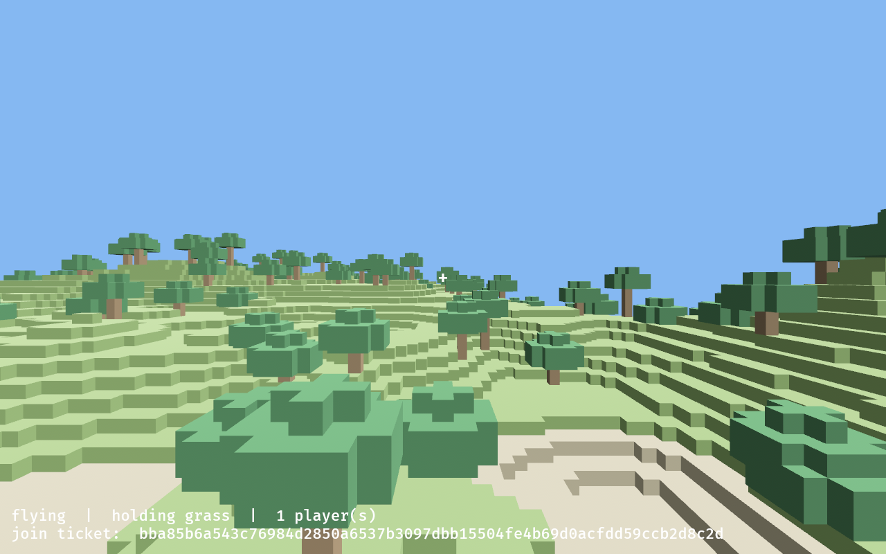
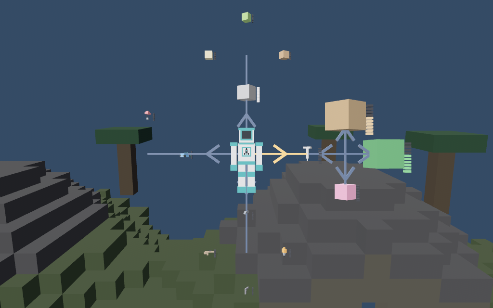
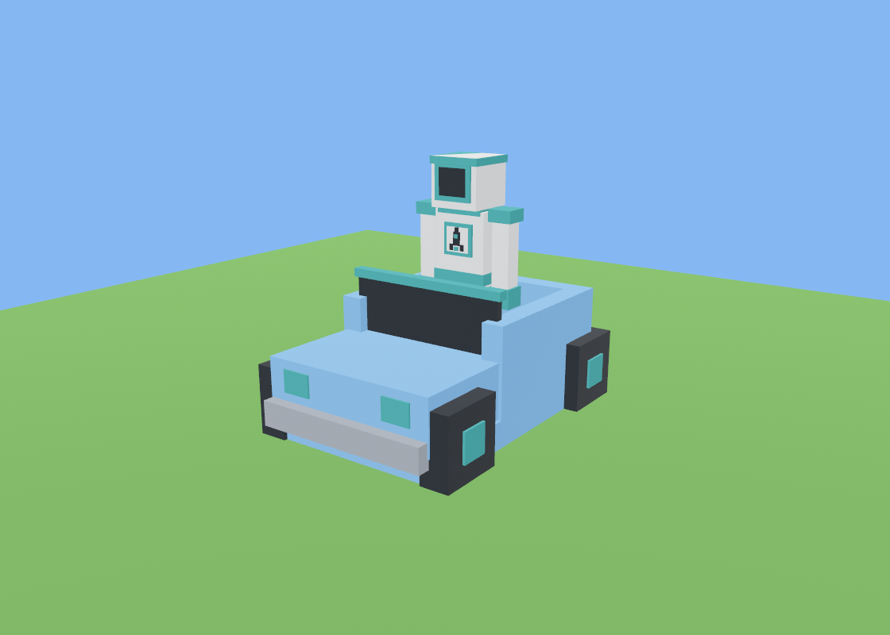
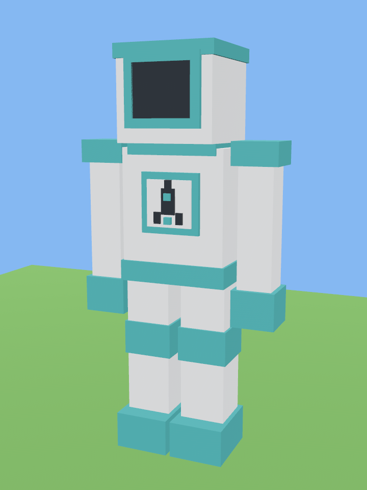

# blockgame

A Minecraft-like voxel world in Rust, built to be extended. Bevy for rendering, iroh for
multiplayer.

Dig up blocks, make things out of them, build with a friend. No mobs and no save file yet.
What gets added on top is `design/`'s business.



## Play

```sh
nix-shell --run 'cargo run --release'
```

You land on a title screen: **Start a new world**, and under it every world being hosted
on this network, by the name of the machine hosting it. D-pad to choose, `A` to go. No
typing, which is the point — the players are on Steam Decks in gaming mode.

A friend who is *not* on this network needs the ticket. Pause (`Start` / `Esc`) →
**Share the join ticket**: it goes on the clipboard and into
`~/.local/share/blockgame/ticket.txt`, which is how you get it off a Deck over ssh. Then:

```sh
nix-shell --run 'cargo run --release -- join <TICKET>'
```

The LAN list is discovery and nothing more — a name and an address, shouted over UDP
broadcast and answered. What happens next is the same iroh connection a ticket makes.

There is no separate server. Running `blockgame` on its own *is* hosting a world with
nobody else in it, so "single player" and "multiplayer" are the same program on the same
code path.

`--seed 12345` picks a specific world. Without it you get a new one every launch. A
joining player ignores their own seed and gets the host's world.

## Controls

|                | keyboard + mouse | gamepad (Steam Deck) |
|----------------|------------------|----------------------|
| move           | `WASD`           | left stick           |
| look           | mouse            | right stick          |
| jump / rise    | `Space`          | `A`                  |
| sprint         | `Shift`          | `R1`                 |
| sink (flying)  | `Ctrl`           | `L1`                 |
| fly on/off     | `F`              | `Y`                  |
| swing / fire   | hold left click  | hold `R2`            |
| place block    | right click      | `L2`                 |
| hotbar         | `1`–`9`, `Q`/`E` | d-pad                |
| craft          | `C`              | `X`                  |
| get in / out   | `R`              | `B`                  |
| pause menu     | `Esc`            | `Start`              |
| menus          | arrows, `Enter`  | d-pad / stick, `A`   |

Quitting is a row on the pause menu, along with sharing the join ticket. It used to be a
`Select`+`Start` chord, which nobody who had not read the source could find.

In the car the left stick is the whole of it: forward and back is the throttle, left and
right is the steering. Everything else works from the seat.

You start in the air, flying, with nothing. Press `F` to drop into walking, then break
something — it is yours.

## Tools and guns

Breaking a block takes a moment, and what is in your hand is how long it takes. A bare
hand is half a second; a **hammer** is quicker and a **drill** is quicker still, both swung
at arm's length. The **handgun** and the **rifle** break blocks at a distance instead —
there is nothing else in the world to shoot at, and the rifle reaches furthest and scopes
in while you hold the trigger. A **nail** is a crafting part and does nothing on its own.

Each of those is three numbers on one row of the registry — how far, how fast, how much it
zooms — so the game has one code path through all of them, and a new tool is a new row.

## Making things

You start empty-handed. Breaking a block puts it in your pocket; placing one spends it.

The hotbar along the bottom is everything there is to hold, and it is also the crafting
menu — there is no second screen and no grid to arrange. Walk the cursor onto a thing and
the line above tells you what it is made of; press craft and, if you have the parts, you
have one.

|             | made of                    |
|-------------|----------------------------|
| nail        | 1 stone                    |
| cushion     | 4 leaves + 1 wood          |
| hammer      | 2 wood + 1 nail            |
| handgun     | 1 wood + 2 nails           |
| rifle       | 2 wood + 3 nails           |
| drill       | 1 wood + 2 stone + 2 nails |
| parachute   | 6 leaves + 2 nails         |
| car         | 6 wood + 2 stone + 8 nails |

The cushion is a block you build with, the parachute changes how you fall, and the car you
drive. The nail is spent in recipes and does nothing on its own — everyone else still sees
it in your hand.



## Falling

Landing hard hurts. A drop of four blocks is free — a jump never costs anything — and past
that it costs hearts in proportion to how fast you hit the ground, with a thirty-block
cliff taking a whole player. The bar is in the top-left corner.

Running out is not death. There is nothing to lose and nowhere to wake up: you are flat on
your back for three seconds, and then you get up where you landed with what those seconds
healed. Hearts come back on their own the whole time. Nothing else in the game hurts you.

Two things make a fall safe, and they are the two the sheets asked for:

A **cushion** is a block, so you put it where you are going to land. Whatever height you
fell from, hitting one costs nothing, and it throws you back up about a sixth of the way —
it is a trampoline as much as a safety mat. One boot on it is enough.

A **parachute** is held, not buckled on: pick its hotbar cell and the canopy is open. You
come down at six blocks a second, slower than a hop lands at, and the stick carries you
further sideways than you fall — so a jump off a tower is a glide to somewhere else. Pick
it *before* you jump; a fall is over in a second or two.

Both are one row of the registry rather than a rule in the game loop. A block says how much
of a landing it gives back; an equippable says how fast you fall wearing it and what the
stick is worth on the way down.

## The car



Six wood, two stone and eight nails, and it is the fastest thing you own — comfortably
quicker than a sprint. Point the hotbar at it and press place to stand it in front of you;
press it again to put it back in your pocket. `B` gets you in, and `B` gets you out on the
driver's side.

Driving is the left stick and nothing else. Steering turns the car, which turns you, which
turns the camera — so the view follows the car without there being a second camera to keep
in step. Look up and down is still yours, and so is the trigger: a hill can be shot at
from the driver's seat.

It hovers over whatever is under its four wheels rather than simulating any. A step up to
a block high is a hill and it drives up it; anything higher is a wall and stops it dead.
Drive off a ledge and it falls. Drive to the edge of the world and it stops, because there
is no ground out there to be on yet.

Your friends see it move with you in it. A car rides the same pose stream your body does —
it is the same kind of fact, "where this player is right now" — which is also what bounds
them: one car each, never more of them in the world than there are people in it. And the
host clears the car off anybody's pose who never built one, because the item is the one
half of a car the host actually owns.

## Who you are



Everyone in the world is this spaceman, drawn from
[`design/spaceman-avatar.jpg`](design/spaceman-avatar.jpg). He is one table of boxes in
`src/avatar.rs`; `blockgame portrait` re-renders the picture above from it,
`blockgame portrait --holding hammer` shows him carrying something — what everyone else
sees when you swap what you are holding — and `blockgame portrait --car --out docs/car.png`
puts him at the wheel, which is how the seat above got checked.

## How it fits together

| file                | what it owns                                                    |
|---------------------|-----------------------------------------------------------------|
| `src/registry.rs`   | **every block and item in the game** — start here to add content |
| `src/inventory.rs`  | what a player has, and what crafting spends                      |
| `src/hud.rs`        | crosshair, status line, and the hotbar you craft from            |
| `src/world.rs`      | chunk storage and seed-deterministic terrain                     |
| `src/mesh.rs`       | turning voxels into geometry                                     |
| `src/player.rs`     | movement, collision, and what a landing costs                    |
| `src/vehicle.rs`    | the car: driving, and getting in and out of one                  |
| `src/raycast.rs`    | what you're looking at                                           |
| `src/avatar.rs`     | **the models** — the spaceman and the car, tables of boxes       |
| `src/portrait.rs`   | `blockgame portrait` — renders those models to `docs/`           |
| `src/input.rs`      | keyboard/mouse/gamepad → one `Intent`                            |
| `src/net/`          | the iroh message bus and wire format                             |
| `src/game.rs`       | the Bevy app that wires the above together                       |

Two design rules hold the rest up:

**The host is authoritative.** It owns the world. A joining player sends *intents* ("I'd
like to break this block") and only applies what the host sends back, so there is one
world and it can't drift.

**Terrain is a pure function of the seed.** Joining ships a `u64` and the list of blocks
anyone has changed since — never chunk data. Break something, and the only thing that
travels is which block, and what it became.

## Adding things

Everything lives in `src/registry.rs`, in two tables.

A **new thing to craft** is one row: an `Item` variant, an arm in `Item::def` naming its
class and its recipe, and an entry in `Item::ALL`. It appears in the hotbar, is craftable,
and travels over the network with no other file touched.

A **new block** is the same plus its own half: a `Block` variant, an arm in `Block::def`
giving it a colour, and an item of class `Block` that places it. Colour lives in the mesh,
so there are no assets to make, and a variant with no arm fails to compile rather than
crashing the first time somebody names it. A row that says nothing about bouncing is plain
ground; say `bounce` and it is soft to land on.

What a tool does is three numbers on its row, and what a wearable does is two more on its
own — how fast you fall in it, and what the stick is worth while you do. What a vehicle
does is `src/vehicle.rs`, and a second one would be that file's constants and a second
table in `src/avatar.rs`.

## Develop

```sh
nix-shell --run 'cargo fmt --check'
nix-shell --run 'cargo clippy --all-targets -- --deny warnings'
nix-shell --run 'cargo test -- --test-threads=2'
```

## License

MIT — see [LICENSE](LICENSE).
