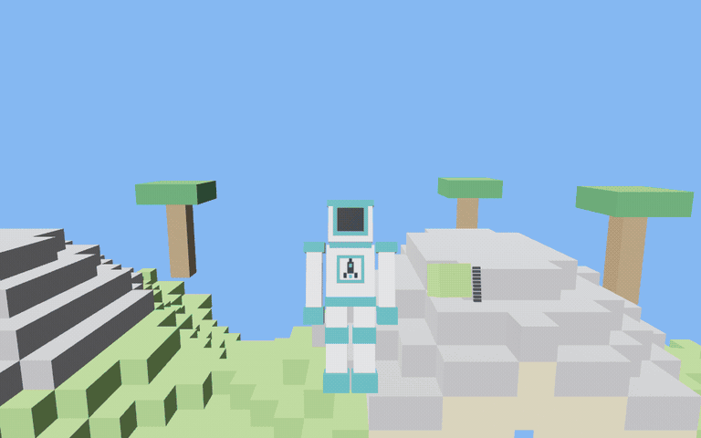

# The belt rig — the hotbar as a body, and a d-pad code for every thing

A design for the hotbar, put up for comparison against the other answers to the same
brief. The prototype is on `design/hotbar-beltrig` and the film below is rendered by
`blockgame craft-film`, which presses a scripted d-pad through the real systems.



## What it replaces

A strip of fourteen boxes along the bottom of the screen, each with a name and a count
written in it, and a line above it spelling out what the thing in your hand cost. Reaching
the far end of it was up to thirteen presses of a step key. Every one of those is a thing a
child who cannot read is shut out of.

## The idea

**Carrying is physical, so draw the carrying.** Your spaceman stands in the bottom of the
screen with the thing in your hand beside him. Press one direction on the d-pad and he
blooms: four clusters, one per direction, each holding four things arranged those same four
ways. Press a second direction and that thing is his. Fourteen items, sixteen stations, two
presses to any of them from anywhere.

**The code is a route, and the route is drawn.** A glowing string runs from his chest out
to each cluster with an arrowhead on it, and on from each cluster to each thing with
another. There is no legend to consult and nothing to memorise: a nail *is* the thing on
the left of the cluster off his right shoulder, and the two arrows you would follow to get
there are lying on the rig pointing the way. The bloom is on screen for every selection, so
the map is re-read every time it is used — which is how a code stops needing to be read at
all and becomes a thing the thumb does.

**The picture and the code are the same fact.** A cluster hangs one direction from the
chest and its things hang one direction from it, and `the_picture_is_the_code` fails if the
geometry and `rig::code` ever stop agreeing. The code itself is derived — an item's place
in `Item::ALL`, read four at a time — so there is no second table to fall out of step with
and a new row in the registry arrives already reachable and already drawn. Sixteen is what
two presses of a four-way pad can name, and a fifteenth cluster is a compile error rather
than an item nobody can select.

## The unification

The recipe rig keeps everything it had — the graph, the beaded strings, the payment — and
loses its cursor. It is now walked by the *same two presses*: a completed code puts that
thing in the middle, and everything it is made of unfolds under it. Under every node on the
rig are the two arrows that reach it, so the alphabet is taught in whichever room the player
happens to be standing in.

That is the whole of the unification, and it is a deletion rather than an addition. There
used to be two navigations — a hotbar you stepped through and a graph you walked, on the
same d-pad, meaning different things in different places. Now there is one, and the code
means the same thing in both rooms: *this thing*. Out in the world that puts it in your
hand; inside the rig it puts it in the middle. Walking out of the rig, you are holding
whatever you last looked at, which is almost always what you came in to make.

It also makes the graph reachable in a way a cursor never was. Anything in the game is two
presses from anywhere in the rig — including the things the graph on screen was not
drawing, which a cursor could not reach at all without walking out through a chain of
neighbours.

## What is on the surface, and what is not

Not one word and not one digit. What a thing is: its silhouette, and the registry's own
colour. How many you own: a bar of notches beside it, lit one per one, the same bar the
recipe rig draws and lit by the same system. Whether you own any at all: full size, or
small and dim. Which two presses reach it: the arrows. Which cluster you are half-way into:
the leg you have already pressed, burning amber.

Deliberately not there:

- **A timer on the half-pressed state.** A child who has pressed one direction and is
  looking at four things is *choosing*. A window that expired under them would take the
  choice away mid-thought. The bloom fills the screen, so being half-way through a code is
  not hidden state anybody can be surprised by.
- **A punishment for guessing wrong.** Two of the sixteen stations are empty. Pressing into
  one leaves the cluster open — you are still where you were and can press again, and you
  are never handed the nearest thing instead.
- **Anything hidden.** A thing you own none of still hangs at its station, because picking
  it is how you get to its recipe.

## What it cost

`src/rig.rs` is new, and is where the wordless alphabet now lives: the silhouettes, the
meshes and paints, the notch bar, the arrowheads, and the code every item answers to. Both
rigs are drawn out of it, so there is one nail shape and one notch bar in the game rather
than two that drift.

Deleted: the hotbar cells and the recipe line, the number row and the two step keys,
`Item::step` and `HOTBAR_COLUMNS`, the recipe rig's cursor and the grid it walked, and
every accessor in the registry that existed only to write words under a hotbar cell — a
tool's summary, a fall's summary, a class's noun. The diff is net negative outside the two
new files.

## Watching it

`blockgame craft-film` drives both rigs through a scripted session and writes one PNG a
frame. It presses the same directions through the same `belt::press` and the same
`forge::Nav` the pad fills, and runs the same systems the game runs, so the film is the
prototype and not a picture of one. Reviewing a change to either rig means watching it:

```sh
nix-shell --run "xvfb-run -s '-screen 0 1024x640x24' cargo run --release -- craft-film"
```
